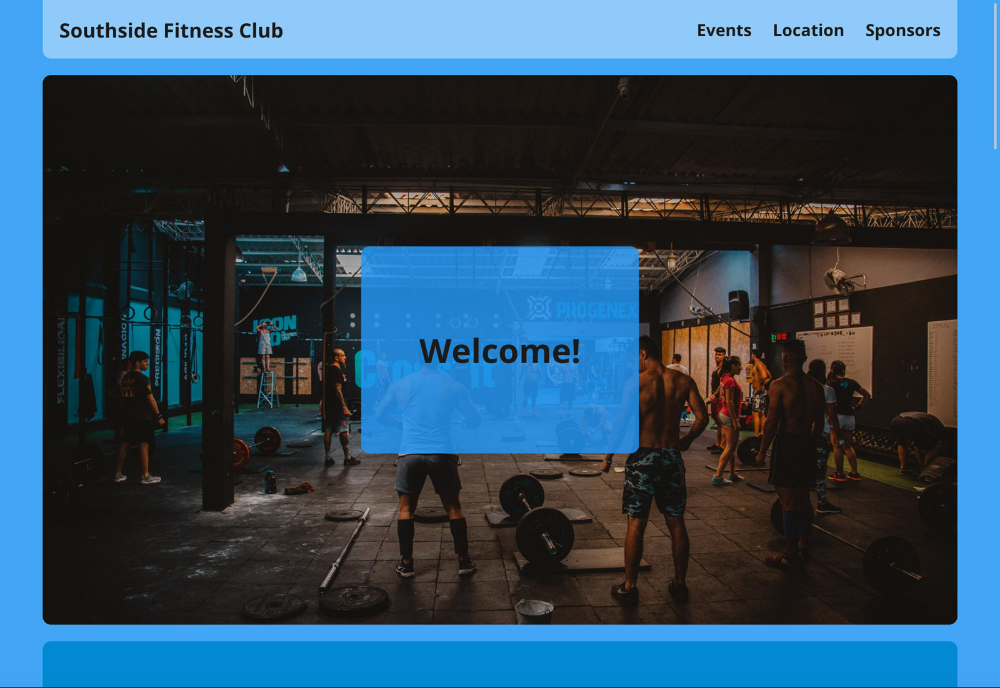

# Southside Fitness - Club Home Page
> Responsive Grid Layout Exercise

## Table of contents
* [General info](#general-info)
* [Screenshots](#screenshots)
* [Technologies](#technologies)
* [See live](#see-live)

## General info
This is a small project, part of the Codecademy Full-stack Engineer Course, which uses grid to create a responsive home page of a fitness club.

## Screenshots

## Technologies
* HTML
* CSS - responsive grid

## See live 
Visit [this link](https://www.atanasdim.com/responsive-grid-fitness-club)
